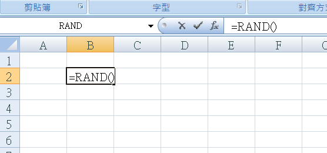
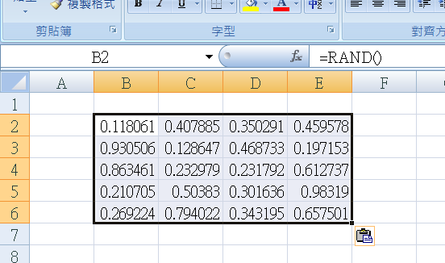
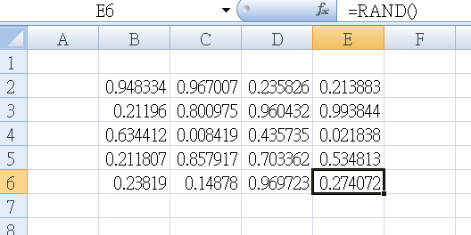
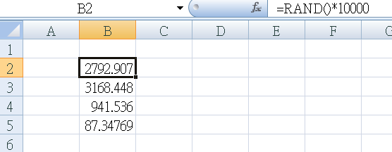
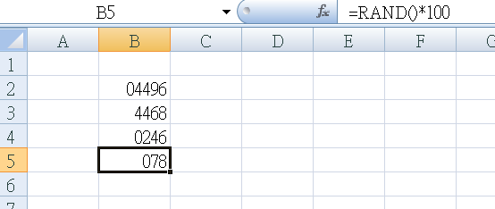
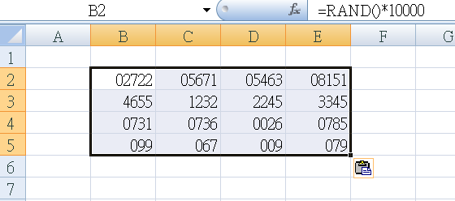

Title: 亂數 RAND
Date: 2017-11-02 20:27
Category: Excel
Tags: RAND
Slug: RAND
Author: 40423222

RAND指令介紹

<!-- PELICAN_END_SUMMARY -->

### RAND( )-範例:
#### 說明:
RAND(): 隨機產生大於0到小於1的值 
注意: 案F9 或 重開檔案 或 輸入值,會更新亂數值

 

第一步: 選擇B2格子,輸入=RAND()
 

 

第二步: 按下鍵盤Enter,就能在B2產生亂數
 

 

第三步: 對B2複製,滑鼠按住B2移動到E6後貼上,就能產生許多亂數
 

 

第四步: 案F9,可以再次產生新亂數
 

### RAND( )範圍-範例:
#### 說明:
RAND()*數值: 隨機產生大於0到小於數值的值 
注意: 案F9 或 重開檔案 或 輸入值,會更新亂數值

 

第一步: 在B2輸入=RAND()\*10000 , B3輸入=RAND()\*5000 , B4輸入=RAND()\*1000 , B5輸入=RAND()\*100

 

第二步: 對B2點右鍵選擇儲存格格式(F) , 到自訂的類型輸入00000 , 同理B3輸入0000 , B4輸入0000 , B5輸入000

 
結果如下圖
 

 

第三步: 複製B2到B5,貼上到B到E 

 
結果如下圖
 
