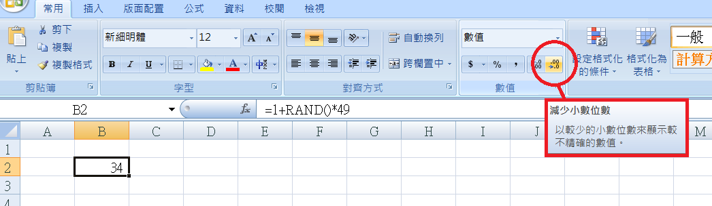

Title: 抽樣 RAND
Date: 2017-11-19 10:00
Category: Excel
Tags: RAND
Slug: SamplingRand
Author: 40423222

使用RAND作抽樣

<!-- PELICAN_END_SUMMARY -->

### 50人抽選一人:
#### 說明:
=1+RAND()\*49: 隨機產生大於等於1到小於等於50的值 
細部說明: =RAND()\*49是產生大於等於0到小於等於49的值,在前面加上1,就是=1+RAND()\*49

注意: 案F9 或 重開檔案 或 輸入值,會更新亂數值 
當抽取人數增多,無法避免重複選出同號碼

 

第一步: 選擇B2格子,輸入=1+RAND()\*49
 

 

第二步: 點擊[常用/數值/減少小數位數],將數值變為整數
 

### 總共50人,號碼1到10為主管剩下為員工,抽取1位主管和5位員工:
#### 說明:
=$C$4+RAND()\*($D$4-$C$4): 隨機產生大於等於$C$4到小於等於$D$4的值 
為了複製D7不引響位址,要將上$符號(第六步驟開使有說明)

$: 絕對位址

注意: 案F9 或 重開檔案 或 輸入值,會更新亂數值 
當抽取人數增多,無法避免重複選出同號碼

 

第一步: 設定好需要使用的值
 

 

第二步: 選擇B7格子,輸入=$C$4+RAND()\*($D$4-$C$4) 
說明: 先完成抽樣的程式形式,方便理解C7和D7
 

 

第三步: 選擇C7格子,輸入=$C$4+RAND()*($E$4-$C$4) 
提示: 觀察B7的程式形式完成,抽樣主管的程式
 

 

第四步: 選擇D7格子,輸入=$F$4+RAND()*($D$4-$F$4) 
提示: 觀察B7的程式形式完成,抽樣主管的程式
 

 

第五步: 複製D7,範圍從D7到D11 
說明: 因為有輸入$,所以位址不會改變
 

 

第六步: $符號說明,選擇B15輸入=C4+RAND()*(E4-C4) 
說明: 不輸入$符號
 

 

第七步: 複製B15[=C4+RAND()\*(E4-C4)],到C15 
說明: 向右一格,英文字變為後一位字母(例如: A => B)
 

 

第八步: 複製B15[=C4+RAND()\*(E4-C4)],到C14 
說明: 向右一格,英文字變為後一位字母(例如: A => B),向上一格數字減一
 

 

第九步: 複製B15[=C4+RAND()\*(E4-C4)],到B14 
說明: 向上一格數字減一
 

 

第十步: 複製B15[=C4+RAND()\*(E4-C4)],到A14 
說明: 向左一格,英文字變為前一位字母(例如: B => A),向上一格數字減一
 

 

第十一步: 複製B15[=C4+RAND()\*(E4-C4)],到A15 
說明: 向左一格,英文字變為前一位字母(例如: B => A)
 

 

第十二步: 複製B15[=C4+RAND()\*(E4-C4)],到A16 
說明: 向左一格,英文字變為前一位字母(例如: B => A),向下一格數字加一
 

 

第十三步: 複製B15[=C4+RAND()\*(E4-C4)],到B16 
說明: 向下一格數字加一
 

 

第十四步: 複製B15[=C4+RAND()\*(E4-C4)],到C16 
說明: 向右一格,英文字變為後一位字母(例如: A => B),向下一格數字加一
 
